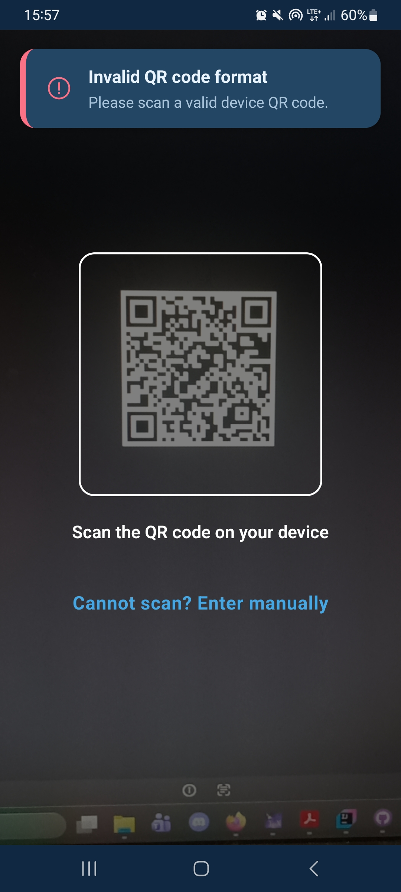

# Audio Violence Detection

  
  
  
  

> [!IMPORTANT]
> **React Native mobile application** for managing a personal safety network. The app connects protected users, trusted contacts, and devices that can report potential danger.
>
> ⚠️ _This engineering-thesis proof of concept does not replace professional emergency services._

## 🧩 Engineering thesis project

Domestic violence often happens behind closed doors, where traditional emergency calls are impossible. This engineering thesis project aims to provide a **discreet, automated safety net**.

Instead of relying only on manual intervention, the system uses **TinyML on an IoT device** to detect signs of violence in real time. When a critical event is classified, the **backend securely routes an alert** to trusted contacts. This mobile app gives protected users and their trusted network a place to manage devices, relationships, alerts, and notifications.

---

This repository contains the **React Native application** in a four-component system:

| Repository                                                                               | Role                                                             |
| ---------------------------------------------------------------------------------------- | ---------------------------------------------------------------- |
| [React Native application](https://github.com/emillia-q/audio-violence-detection-mobile) | Mobile experience for protected and trusted users                |
| [Backend API](https://github.com/emillia-q/audio-violence-detection-backend)             | Authentication, device lifecycle, alerts, and user relationships |
| [IoT hardware](https://github.com/emillia-q/audio-violence-detection-hardware)           | Edge device that runs the model and sends alerts                 |
| [TinyML model](https://github.com/emillia-q/audio-violence-detection-tinyml)             | On-device audio violence classification                          |

## 🎬 Demo

### Video preview

Preview of the application in use from the users perspective.

  <video src="https://github.com/user-attachments/assets/ba57972f-3cfa-43a6-bb9f-39862ee69104"></video>

### Adding a device with a QR code

Users can add a device by scanning its QR code in the app.

  

## ✨ Key features

- 🔐 **Authentication:** registration and login with validated forms; session tokens are stored using Expo SecureStore.
- 👥 **Two user experiences:** switch between protected-user and trusted-user dashboards, including swipe navigation.
- 📟 **Device management:** pair a device, view its details, update its name, and disconnect it.
- 🤝 **Trusted network:** add and manage trusted contacts, or view the people you protect.
- 🚨 **Alerts and notifications:** review event history, manage read status, and refresh dashboard data.
- 🌐 **API integration:** authenticated REST requests, session cleanup on expired credentials, and connection/server error feedback.

## 🛠️ Tech stack

- **Core:** React Native, React 19, TypeScript, Expo SDK 54
- **Navigation:** Expo Router with file-based routing
- **Networking:** Axios for REST API communication
- **Forms:** React Hook Form and Zod for form state and validation
- **Secure storage:** Expo SecureStore for token persistence
- **Gestures:** React Native Pager View for swipeable dashboard modes

## 👩‍💻 Author

Built by [Emilia Kura](https://github.com/emillia-q) as part of an engineering thesis.
